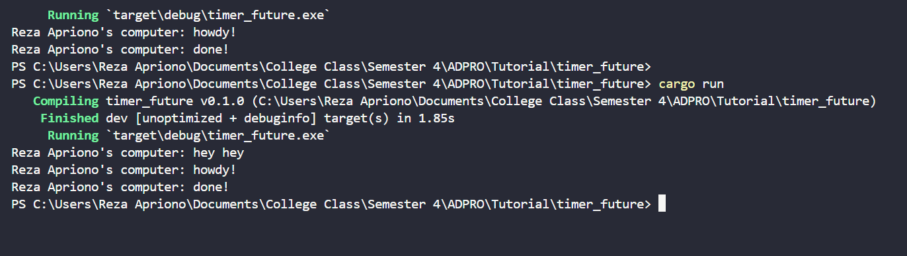

# 1.2 Understanding how it works.

Dari output yang muncul saat menjalankan program, terlihat bahwa teks "Reza Apriono's computer: hey hey" diprint sebelum teks "Reza Apriono's computer: howdy!" dan "Reza Apriono's computer: done!". Task asynchronous yang mencetak “Reza Apriono's computer: howdy!”, menunggu selama dua detik, dan kemudian mencetak “Reza Apriono's computer: done!” sudah dispawn. Namun, karena sifat asynchronousnya, task ini tidak langsung dijalankan. Dengan adanya `spawner.spawn(async { ... });`, task tersebut akan dieksekusi secara asynchronous, yang artinya tidak menunggu task sebelumnya selesai sebelum melanjutkan ke perintah berikutnya. Oleh karena itu, "Reza Apriono's computer: hey hey" yang berada di luar fungsi async akan diprint terlebih dahulu karena task yang bertugas mencetak "Reza Apriono's computer: howdy!" dan "Reza Apriono's computer: done!" masih menunggu hasil dari future, sementara  fungsi main melanjutkan eksekusi selagi task tersebut menunggu. Jadi, pesan "Reza Apriono's computer: hey hey" muncul lebih dulu karena dicetak sebelum task yang di-spawn selesai dijalankan.